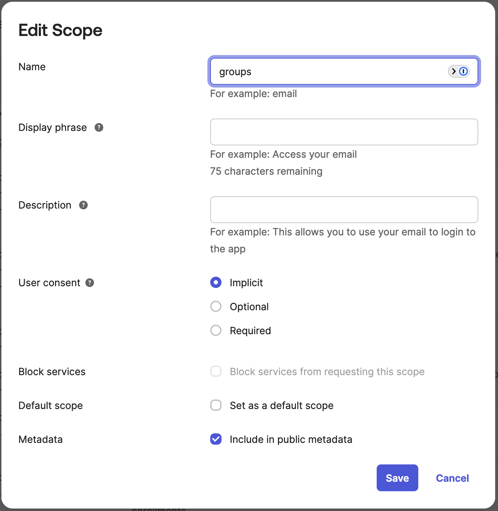
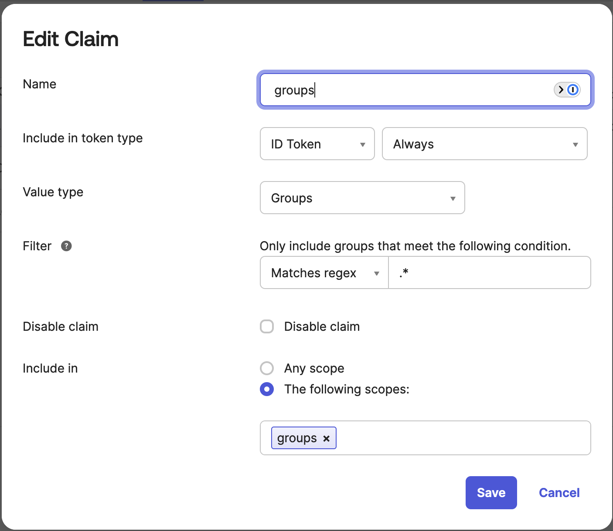

# UpCloud Kubernetes Service User Authentication with Pinniped

There are various ways to do user authentication in Kubernetes. Usually this means using OIDC compliant authentication provider such as Okta with the Kubernetes built-in support for OIDC. However, with managed Kubernetes services such as UKS, the OIDC parameters of the Kubernetes API are not typically available for end users to modify. Also, Kubernetes doesn't come with a proper built-in authentication service that can manage the users and authentication provider. In this tutorial, we will look at [Pinniped](https://pinniped.dev/) and how it can provide a full enterprise level authentication service to UKS. Pinniped bypasses the regular Kubernetes API and provides an alternative API for authenticated users to use the Kubernetes cluster the normal kubectl way. The native UKS cluster admin authentication with kubeconfig files remains available for admins.

## Prerequisites

You will need the following tools and environments to be installed and configured. Pinniped supports several ways of doing user authentication, we will be using Okta in this example. The [documentation](https://pinniped.dev/docs/) has several other examples as well.

* [Supervisor UKS cluster](https://upcloud.com/products/managed-kubernetes)
* [Workload UKS cluster](https://upcloud.com/products/managed-kubernetes)
* cert-manager configured with a CA, such as Let's Encrypt
* Okta (developer) account
* DNS Service and available DNS Domain
* [pinniped CLI](https://pinniped.dev/docs/howto/install-cli/)

## Configure Supervisor Cluster with Pinniped Supervisor

This guide will follow the [official Pinniped documentation](https://pinniped.dev/docs/tutorials/concierge-and-supervisor-demo/). We will be installing the Pinniped Supervisor service, which acts as a central authentication service for all the Kubernetes clusters in your environment. In general, the guide works well, but there are some UpCloud specific settings needed, which we will cover below. The documented Okta configuration also had some issues, which are also covered here.

Start by deploying the Supervisor components to your `Supervisor UKS cluster`. Run all the commands as the `cluster admin`.

```{text}
kubectl apply -f https://get.pinniped.dev/v0.29.0/install-pinniped-supervisor.yaml
```

Next we will need a load balancer to act as a Kubernetes API endpoint for the authenticated users. The yaml file below will create a suitable load balancer in UpCloud with TCP mode enabled. You can modify the yaml file as necessary, for example change the load balancer type to `production-small`.

```{text}
kubectl apply -f supervisor_lb.yaml
```

`supervisor-lb.yaml`:
```
apiVersion: v1
kind: Service
metadata:
  name: pinniped-supervisor-loadbalancer
  namespace: pinniped-supervisor
  annotations:
    service.beta.kubernetes.io/upcloud-load-balancer-config: |
      {
        "name": "pinniped-supervisor-loadbalancer",
        "plan": "development",
        "frontends": [
          {
            "name": "https",
            "mode": "tcp",
            "port": 443
          }
        ],
        "backends": [
          {
            "name": "https"
          }
        ]
      }
spec:
  type: LoadBalancer
  selector:
    app: pinniped-supervisor
  ports:
  - protocol: TCP
    name: "https"
    port: 443
    targetPort: 8443 # 8443 is the TLS port.
```

Now we have the Pinniped Supervisor up and running, and a Load Balancer for the new Kubernetes API. Next you need to choose a domain name for the Pinniped Supervisor, and update your DNS Service to point the chosen domain name to the Pinniped Supervisor Load Balancer public DNS name. You could also automate this part with External DNS if needed. The command below will give you the Load Balancer public DNS name:

```{text}
kubectl get svc -n pinniped-supervisor  pinniped-supervisor-loadbalancer -o jsonpath={.status.loadBalancer.ingress[0].hostname}
```

To finalize the configuration, you will need a certificate for the chosen domain name. An example file has been provided, which uses cert-manager, Let's Encrypt and Gandi, but your setup might differ.

```{text}
kubectl apply -f supervisor-tls.yaml
```

`supervisor-tls.yaml`:
```
apiVersion: cert-manager.io/v1
kind: Certificate
metadata:
  name: supervisor-tls-cert-request
  namespace: pinniped-supervisor
spec:
  secretName: supervisor-tls-cert
  issuerRef:
    # The cert-manager Issuer created in the step above.
    name: letsencrypt-prod
    kind: ClusterIssuer
  dnsNames:
  - pinniped.example.com
```

The last thing to do is to configure a Federation Domain, which will act as a OIDC provider for workload clusters and Pinniped CLI. Use your chosen domain name, and add an arbitrary path to it. Note that the Pininped documentation tells you to test the Federation Domain with a curl command, but it will fail until we have configured the Okta OIDC provider.

```{text}
kubectl apply -f federationdomain.yaml
```

`federationdomain.yaml`:
```
apiVersion: config.supervisor.pinniped.dev/v1alpha1
kind: FederationDomain
metadata:
  name: federation-domain
  namespace: pinniped-supervisor
spec:
  # You can choose an arbitrary path for the issuer URL.
  issuer: "https://pinniped.example.com/pinniped-issuer"
  tls:
    # The name of the secretName from the cert-manager Certificate
    # resource above.
    secretName: supervisor-tls-cert
```

## Create Okta Application

If you are not familiar with Okta, follow the [Pinniped documentation](https://pinniped.dev/docs/howto/supervisor/configure-supervisor-with-okta/) to create an Okta application. One thing missing from the documentation is that the groups scope is missing by default in the Pinniped Application. That is needed if you want to create Role Bindings in Kubernetes based on Groups instead of direct user names. When creating the Application, also add a test user and a group called `pinniped` for that user, we can use them later for testing.

In Okta, navigate to Security -> Api -> Authorization server and edit the default Authorization Server, unless you have a custom setup. Go to Scopes and click Add Scope. Name the score as `groups`. See the screenshot below for further settings. Click Save.



Click the next tab called Claims and click Add Claim. Create the claim as in the screenshot below for `groups`.



Now we can connect Okta and the Pinniped Supervisor. Run all the commands as the `cluster admin` on the `Supervisor UKS cluster`.

```{text}
kubectl apply -f okta_oidc.yaml
```

`okta_oidc.yaml`:
```
apiVersion: idp.supervisor.pinniped.dev/v1alpha1
kind: OIDCIdentityProvider
metadata:
  namespace: pinniped-supervisor
  name: okta
spec:

  # Specify the upstream issuer URL (no trailing slash). Change this to be the
  # actual issuer provided by your Okta account.
  issuer: https://your_okta_domain.okta.com/oauth2/default

  # Specify how to form authorization requests to Okta.
  authorizationConfig:

    # Request any scopes other than "openid" for claims besides
    # the default claims in your token. The "openid" scope is always
    # included.
    #
    # To learn more about how to customize the claims returned, see here:
    # https://developer.okta.com/docs/guides/customize-tokens-returned-from-okta/overview/
    additionalScopes: [groups, email]

  # Specify how Okta claims are mapped to Kubernetes identities.
  claims:

    # Specify the name of the claim in your Okta token that will be mapped
    # to the "username" claim in downstream tokens minted by the Supervisor.
    username: email

    # Specify the name of the claim in Okta that represents the groups
    # that the user belongs to. This matches what you specified above
    # with the Groups claim filter.
    groups: groups

  # Specify the name of the Kubernetes Secret that contains your Okta
  # application's client credentials (created below).
  client:
    secretName: okta-client-credentials

---
apiVersion: v1
kind: Secret
metadata:
  namespace: pinniped-supervisor
  name: okta-client-credentials
type: secrets.pinniped.dev/oidc-client
stringData:

  # The "Client ID" that you got from Okta.
  clientID: "" # Client ID from Okta application

  # The "Client secret" that you got from Okta.
  clientSecret: "" # Client Secret from Okta application
```

You can now test that the Federation Domain works. Running the following command using the chosen domain name should return a valid json output.

```{text}
curl "https://pinniped.example.com/pinniped-issuer/.well-known/openid-configuration"
```

## Configure Workload Cluster with Pinniped Concierge

Pinniped Supervisor is now ready. The last thing to do is to implement the Concierge on any workload clusters that you might have. Pinniped Concierge enables OIDC authentication for the Kubernetes workload cluster. When combined with the Supervisor, no user information is embedded in the kubeconfig file, and it can be freely shared with users. The kubeconfig file is made for a particular cluster, and won't work on other Kubernetes clusters in the environment.

Run all the commands as the **cluster admin** on the **Workload UKS cluster**.

```{text}
kubectl apply -f jwtauthenticator_workload.yaml
```

`jwtauthenticator_workload.yaml`:
```
apiVersion: authentication.concierge.pinniped.dev/v1alpha1
kind: JWTAuthenticator
metadata:
  name: pinniped-supervisor-jwt-authenticator
spec:
  # This should be the issuer URL that was declared in the FederationDomain.
  issuer: "https://pinniped.example.com/pinniped-issuer"
  # Replace this with your own unique value.
  audience: pinniped-cluster-ed9de33c370981f61e9c
```

Run the following command to install the necessary CRDs for the Pinniped Concierge:

```{text}
kubectl apply -f https://get.pinniped.dev/v0.30.0/install-pinniped-concierge-crds.yaml
```

The actual Concierge deployment has to be modified for it to create a right kind of Load Balancer in UpCloud. Download the configuration yaml file and modify the CredentialIssuer part as below. You can again modify the Load Balancer settings as necessary.

```{text}
wget "https://get.pinniped.dev/v0.30.0/install-pinniped-concierge-resources.yaml"
```

`install-pinniped-concierge-resources.yaml`:
```
---
apiVersion: config.concierge.pinniped.dev/v1alpha1
kind: CredentialIssuer
metadata:
  name: pinniped-concierge-config
  labels:
    app: pinniped-concierge
spec:
  impersonationProxy:
    mode: auto
    service:
      type: LoadBalancer
      annotations:
        service.beta.kubernetes.io/aws-load-balancer-connection-idle-timeout: "4000"
        service.beta.kubernetes.io/upcloud-load-balancer-config: |
          {
            "name": "pinniped-cluster-concierge",
            "plan": "development",
            "frontends": [
              {
                "name": "config_443",
                "mode": "tcp",
                "port": 443
              }
            ]
          }
---
```

Install the Concierge:

```{text}
kubectl apply -f install-pinniped-concierge-resources.yaml
```

After the Load Balancer have been deployed, we are done!

Let's test the setup. Create a `dev` namespace:

```{text}
kubectl create ns dev
```

Pinniped does only Authentication, not Authorization! For that part, we can use standard Kubernetes RBAC to define what our users can do in the cluster. Below we have an example where we give a group called `pinniped` edit rights to the namespace `dev` we just created.

```{text}
kubectl apply -f test-group-rbac.yaml
```

`test-group-rbac.yaml`:
```
apiVersion: rbac.authorization.k8s.io/v1
kind: RoleBinding
metadata:
  name: developer-can-edit-dev-ns
  namespace: dev
subjects:
- kind: Group
  name: pinniped # Can be any group you have configured in Okta
  apiGroup: rbac.authorization.k8s.io
roleRef:
  kind: ClusterRole
  name: edit
  apiGroup: rbac.authorization.k8s.io
```

Time to create the kubeconfig file for the end user. You need to have the Workload UKS `cluster admin` kubeconfig file for this. The following command uses the pinniped CLI to create a Pinniped compatible kubeconfig file that the users can use to authenticate for this particular cluster. It will work for all the users and you only need to create it per cluster. Notice how the kubeconfig file does not contain any identifiable information on the users, and it is pointing to the Supervisor Load Balancer we created earlier.

```{text}
pinniped get kubeconfig > workload1-developer.yaml --kubeconfig workload-cluster-admin.yaml
```

If everything went ok, you should now be able to use the `dev` namespace, but commands outside of that namespace will fail.

```{text}
kubectl get pods -n dev --kubeconfig workload1-developer.yaml
```

```{text}
kubectl get pods -n default --kubeconfig workload1-developer.yaml
```